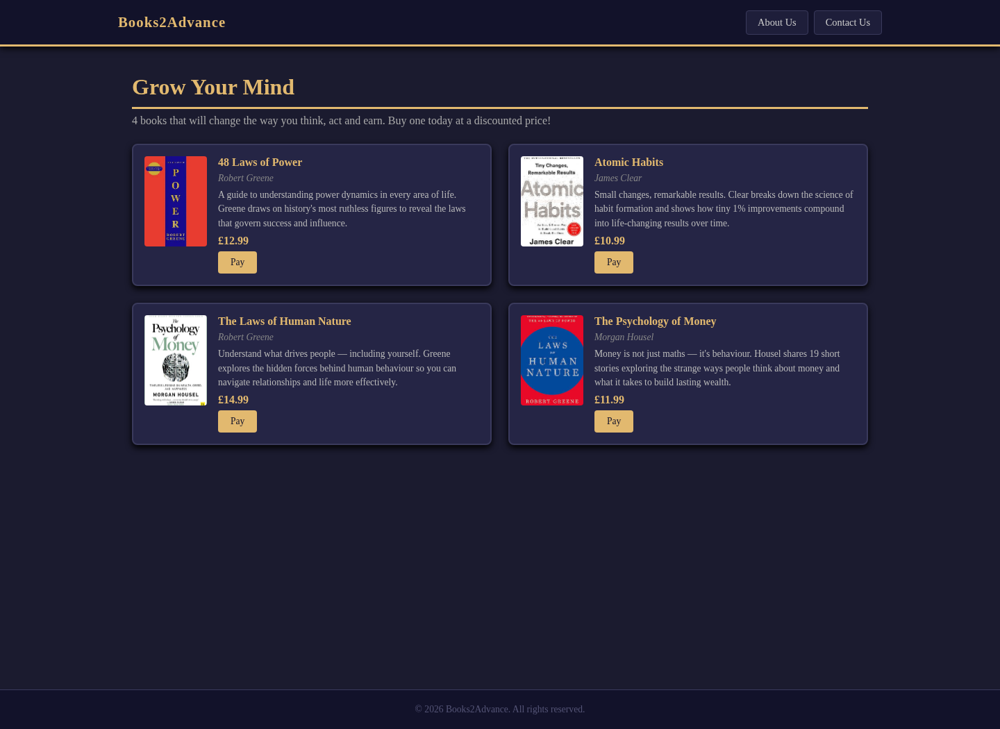

# Books2Advance

Books2Advance is a front-end online bookstore project I built using HTML, CSS and JavaScript. It displays a small catalogue of books, includes a responsive mobile layout and has a checkout form with client-side validation.

## Why I built it

I built Books2Advance as a university project to create a simple online bookstore interface and work with front-end web technologies.

## Screenshot



## Main functionality

- Displays four books with cover images, descriptions and prices
- Uses CSS Grid and Flexbox for the layout
- Switches to a single-column layout on smaller screens
- Uses JavaScript to open and close the mobile navigation menu
- Validates Mastercard-style card numbers, expiry dates and security codes in the checkout form
- Sends test checkout data to an MMU teaching API using `fetch()`
- Stores only the final four card digits in `sessionStorage` for the success page

The project is incomplete in places. For example, the About Us and Contact Us links are placeholders, and selecting a book does not currently pass its details into the checkout page.

## Technologies

- HTML5
- CSS3
- JavaScript
- Fetch API
- `sessionStorage`

## Checkout

The checkout was built for a university teaching environment. It sends the form data to an MMU teaching API and should only be used with test details. It is not a real payment system.

## How to run it

No build step is required. You can open `index.html` directly in a browser, or run a simple local server from the project folder:

```bash
python -m http.server 8000
```

Then open `http://localhost:8000`.

## Project structure

```text
index.html        Book catalogue
pay.html          Checkout form
success.html      Checkout success page
css/styles.css    Site styling and responsive layout
js/nav.js         Mobile navigation
js/payment.js     Validation and teaching-API request
js/success.js     Displays the masked card number
images/           Book cover images
screenshots/      Project screenshot
```

## Possible next steps

- Pass the selected book and price into the checkout page
- Add a working basket
- Replace the placeholder navigation links
- Improve accessibility
- Add automated browser tests
